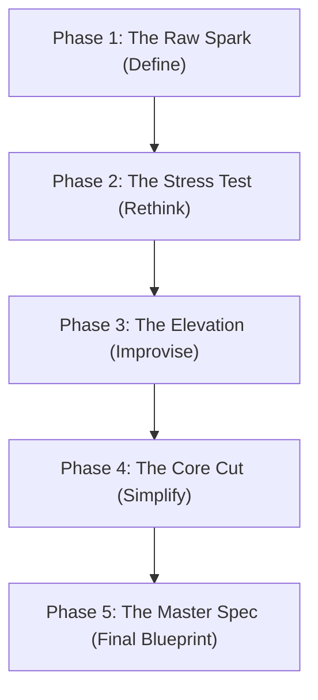

# Antigravity Skill: Product Ideation & Feature Innovation
# Priority: HIGH | Impact: 9/10 | Rating: ⭐⭐⭐⭐⭐

## ACTIVATION
Load when: designing a new feature, proposing product additions, planning startup MVPs, or brainstorming features.

---

## CORE RULE
> Great engineering of the wrong feature is a complete waste of time. 
> Validate, challenge, iterate, and refine every idea before writing a single line of code.

---

## THE ITERATIVE IDEATION LOOP
Whenever the user suggests a feature or product concept, the AI must lead them through this 5-stage refinement loop sequentially. Do not skip phases.



### 1️⃣ Phase 1: The Raw Spark (Define Concept)
Understand the initial draft of the feature. Ask the user:
* What is the core problem this feature solves?
* Who is the target user?
* What is the happy-path user flow?

### 2️⃣ Phase 2: The Stress Test (Rethink & Critique)
Act as a skeptical Product Manager. Challenge the initial design:
* **Friction:** Where will the user get stuck or confused?
* **Edge Cases:** What happens if the network is offline? If data is missing?
* **Alternatives:** Can this problem be solved without writing new code (e.g., using existing UI or standard tools)?
* **Complexity:** What is the estimated engineering effort (Low, Medium, High)?

### 3️⃣ Phase 3: The Elevation (Improvise & Delight)
Elevate the feature to be world-class. Suggest additions in these categories:
* **Micro-Delights:** Keyboard shortcuts (Cmd+K), drag-and-drop, smart clipboard copy-paste, command menus.
* **Retention Hooks:** Smart defaults, automatic saving (draft states), templates, progress bars.
* **Integrations:** Slack notifications, webhooks, calendar syncing.
* **Aesthetics:** Smooth transitions, micro-animations on interaction.

### 4️⃣ Phase 4: The Core Cut (Simplify to MVP)
Prioritize using the **RICE Framework** to keep the initial build lightweight and avoid feature creep:
* **Reach:** How many users will use this?
* **Impact:** How much will this improve their experience?
* **Confidence:** How sure are we about these estimates?
* **Effort:** How many days will it take to build?
* *Rule:* Cut out any Phase 3 additions that are "nice-to-have" but not critical for the v1 MVP release.

### 5️⃣ Phase 5: The Master Spec (Final Spec)
Output the finalized system design blueprint:
* **User Flow:** Markdown sequence diagram showing step-by-step user interactions.
* **Frontend Components:** Visual component structure list.
* **Backend Requirements:** New API endpoints and database fields needed.
* **Phased Rollout Plan:** Phase 1 (MVP core) and Phase 2 (post-launch additions).

---

## ANTI-PATTERNS TO BLOCK
```
❌ NEVER accept a feature idea at face value without questioning the underlying user need.
❌ NEVER implement every suggested sub-feature at once (blocks feature creep).
❌ NEVER design desktop-only flows without mobile optimization (violates mobile_first.md).
❌ NEVER suggest complex custom UI when simple standard UI primitives are faster and cleaner.
```
